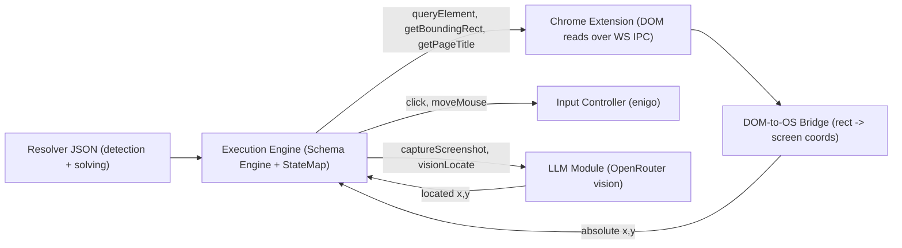

# Goal

Captcha algorithms must be extensible. Each algorithm is a "resolver" stored as
JSON. By default the app ships with **Cloudflare Turnstile**.

Resolvers may optionally use the backend LLM module (OpenRouter) for vision-based
steps (`captureScreenshot`, `visionLocate`). The built-in Turnstile resolver does
not require LLM.

Resolvers are stored as JSON in two places:

- Built-in resolvers are embedded within the app.
- User-created resolvers live in the captcha-resolvers folder, see "### Captcha
  resolvers dir" in
  [architecture/data-management.md](../architecture/data-management.md)
  (`InstallDir/<appVersion>/captcha-resolvers`).

## Concept

A resolver is made of two parts:

- `detection`: a side-effect-free predicate that decides whether this captcha is
  present on the current page.
- `solving`: an ordered sequence of actions that interacts with the DOM and the
  OS to solve the captcha.

Both detection and solving never touch the browser directly. They are
declarative steps that the backend Execution Engine interprets, dispatching the
real work to the Chrome extension (DOM reads), the Input Controller (OS
mouse/keyboard), and optionally the LLM module (vision).



The engine maintains a per-run variable store (the `StateMap`, see section 2.1
of [architecture/execution-engine.md](../architecture/execution-engine.md)).
Solving steps read and write named variables in this store.

## Detection

Detection is a `matchMode` (`all` or `any`) applied over a list of condition
steps:

- `all`: every condition must hold for a positive hit.
- `any`: at least one condition must hold.

Detection conditions MUST be side-effect free (read-only). For Cloudflare
Turnstile the positive hit is the page title containing "Just a moment" AND the
page containing `input[id*=cf-chl-widget]`.

Available detection steps:

- `pageTitle`: matches the document title against a `StringMatch`.
- `elementExists`: true if the selector resolves to at least one element.
- `elementText`: matches the text of the selected element against a
  `StringMatch`.
- `urlMatches`: matches the current URL against a `StringMatch`.

## Solving

`solving.steps` is an ordered array of `SolvingStep` executed top to bottom
against the variable store. Steps fall into four groups:

- DOM reads (via Chrome extension / DOM-to-OS Bridge):
  - `queryElement`: resolves a selector to an element handle and saves a
    reference. When `useParentNode` is true, the handle points at the resolved
    element's `parentNode`.
  - `getBoundingRect`: reads `getBoundingClientRect()` for a referenced handle
    and saves `{ x, y, width, height, top, left }`. The bridge converts these to
    absolute screen coordinates (see section 2.3 of
    [architecture/execution-engine.md](../architecture/execution-engine.md)).
  - `getPageTitle`: saves the current document title.
- OS inputs (via Input Controller / enigo, see section 2.4):
  - `moveMouse`: travels from the current cursor position to a coordinate over a
    humanized Bézier path (never teleports).
  - `click`: travels to a coordinate over a humanized path, then clicks. All
    pointer movement follows the no-teleport invariant and UserClient criteria in
    [architecture/execution-engine.md](../architecture/execution-engine.md) section
    2.4.
- Vision / LLM (optional, via OpenRouter):
  - `captureScreenshot`: captures the viewport or a referenced element region
    and saves the image.
  - `visionLocate`: sends an image + prompt to the LLM and saves the returned
    `{ x, y }` coordinate for a later `click` to consume.
- Flow control & state:
  - `wait`: pauses for a fixed duration.
  - `setVariable`: writes a computed `ValueExpr` into a named variable.
  - `checkCondition`: evaluates a `Condition`; if it does NOT hold, applies
    `onFail` (`break` the enclosing loop, `fail` the resolver, or `continue`).
  - `loop`: repeats its child steps while the `while` condition holds, bounded
    by `maxIterations`.
  - `break`: exits the enclosing loop, optionally guarded by an `if` condition.

Coordinates use `ValueExpr`: literal, `{ "ref": "rect.left" }`, or arithmetic
(`add`/`sub`/`mul`/`div`).

## Types and Interfaces

```typescript
export interface CaptchaResolver {
  id: string;
  title: string;
  schemaVersion: string;
  description?: string;
  detection: DetectionConfig;
  solving: SolvingConfig;
}

export interface DetectionConfig {
  matchMode: "all" | "any";
  conditions: DetectionStep[];
}

export type DetectionStep =
  | { type: "pageTitle"; match: StringMatch }
  | { type: "elementExists"; selector: string }
  | { type: "elementText"; selector: string; match: StringMatch }
  | { type: "urlMatches"; match: StringMatch };

export type StringMatch =
  | { mode: "equals"; value: string }
  | { mode: "contains"; value: string }
  | { mode: "regex"; pattern: string; flags?: string };

export interface SolvingConfig {
  steps: SolvingStep[];
}

export type SolvingStep =
  | {
      type: "queryElement";
      selector: string;
      useParentNode?: boolean;
      saveToVariable: string;
    }
  | { type: "getBoundingRect"; targetVariable: string; saveToVariable: string }
  | { type: "getPageTitle"; saveToVariable: string }
  | {
      type: "moveMouse";
      x: ValueExpr;
      y: ValueExpr;
      includeRandomness?: boolean;
    }
  | { type: "click"; x: ValueExpr; y: ValueExpr }
  | {
      type: "captureScreenshot";
      region: "viewport" | "element";
      targetVariable?: string;
      saveToVariable: string;
    }
  | {
      type: "visionLocate";
      imageVariable: string;
      prompt: string;
      saveToVariable: string;
    }
  | { type: "wait"; ms: number }
  | { type: "setVariable"; name: string; value: ValueExpr }
  | {
      type: "checkCondition";
      condition: Condition;
      onFail: "break" | "fail" | "continue";
    }
  | {
      type: "loop";
      while: Condition;
      maxIterations: number;
      steps: SolvingStep[];
    }
  | { type: "break"; if?: Condition };

export type Condition =
  | { type: "pageTitle"; match: StringMatch }
  | { type: "elementExists"; selector: string }
  | { type: "elementHidden"; selector: string }
  | {
      type: "compare";
      left: ValueExpr;
      op: "<" | "<=" | ">" | ">=" | "==" | "!=";
      right: ValueExpr;
    };

export type ValueExpr =
  | number
  | string
  | boolean
  | { ref: string }
  | { op: "add" | "sub" | "mul" | "div"; args: ValueExpr[] };
```

## Resolvers

### Cloudflare Turnstile

Detect:

- Page title contains "Just a moment" AND `input[id*=cf-chl-widget]` exists.

Solve:

- Resolve `input[id*=cf-chl-widget]` and take its `parentNode` as the target.
- Read the parent node's bounding rect.
- Click across the parent node at its vertical center. Start at `left + 100`,
  wait 2s between clicks, re-check title. Increment X by +100 until
  `>= parentNode.width` or title no longer matches.

See [## Examples](#examples).

## Examples

### Cloudflare Turnstile resolver

```json
{
  "id": "cloudflare-turnstile",
  "title": "Cloudflare Turnstile",
  "schemaVersion": "1.0",
  "detection": {
    "matchMode": "all",
    "conditions": [
      {
        "type": "pageTitle",
        "match": { "mode": "contains", "value": "Just a moment" }
      },
      { "type": "elementExists", "selector": "input[id*=cf-chl-widget]" }
    ]
  },
  "solving": {
    "steps": [
      {
        "type": "queryElement",
        "selector": "input[id*=cf-chl-widget]",
        "useParentNode": true,
        "saveToVariable": "widget"
      },
      {
        "type": "getBoundingRect",
        "targetVariable": "widget",
        "saveToVariable": "rect"
      },
      { "type": "setVariable", "name": "clickX", "value": 100 },
      {
        "type": "loop",
        "maxIterations": 20,
        "while": {
          "type": "pageTitle",
          "match": { "mode": "contains", "value": "Just a moment" }
        },
        "steps": [
          {
            "type": "checkCondition",
            "condition": {
              "type": "compare",
              "left": { "ref": "clickX" },
              "op": ">=",
              "right": { "ref": "rect.width" }
            },
            "onFail": "break"
          },
          {
            "type": "click",
            "x": {
              "op": "add",
              "args": [{ "ref": "rect.left" }, { "ref": "clickX" }]
            },
            "y": {
              "op": "add",
              "args": [
                { "ref": "rect.top" },
                { "op": "div", "args": [{ "ref": "rect.height" }, 2] }
              ]
            }
          },
          { "type": "wait", "ms": 2000 },
          {
            "type": "setVariable",
            "name": "clickX",
            "value": { "op": "add", "args": [{ "ref": "clickX" }, 100] }
          }
        ]
      }
    ]
  }
}
```

## Acceptance

- [ ] Built-in Cloudflare Turnstile resolver JSON embedded and loads at runtime
- [ ] User resolvers load from `InstallDir/<appVersion>/captcha-resolvers`
- [ ] Detection runs side-effect-free before solving
- [ ] Turnstile example JSON detects and solves per this spec
- [ ] Solving steps dispatch through humanized Input Controller (no teleport)
- [ ] `/captcha-resolvers` UI lists built-in and user resolvers as cards
